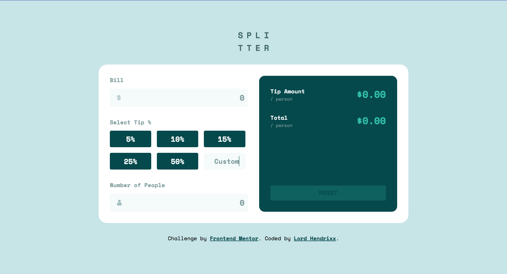

# Frontend Mentor - Tip calculator app solution

This is a solution to the [Tip calculator app challenge on Frontend Mentor](https://www.frontendmentor.io/challenges/tip-calculator-app-ugJNGbJUX). Frontend Mentor challenges help you improve your coding skills by building realistic projects.

## Table of contents

- [Overview](#overview)
  - [The challenge](#the-challenge)
  - [Screenshot](#screenshot)
  - [Links](#links)
- [My process](#my-process)
  - [Built with](#built-with)
  - [What I learned](#what-i-learned)
  - [Continued development](#continued-development)
  - [Useful resources](#useful-resources)
- [Author](#author)
- [Acknowledgments](#acknowledgments)

**Note: Delete this note and update the table of contents based on what sections you keep.**

## Overview

### The challenge

Users should be able to:

- View the optimal layout for the app depending on their device's screen size
- See hover states for all interactive elements on the page
- Calculate the correct tip and total cost of the bill per person

### Screenshot

### Links

- Solution URL: [Vercel](https://tip-calculator-app-git-main-beealmightys-projects.vercel.app/)
- Live Site URL: [Port:5500](http://127.0.0.1:5500/)

## My process

### Built with

- Semantic HTML5 markup
- CSS custom properties
- Flexbox
- CSS Grid
- Mobile-first workflow
- Vanilla Javascript

### What I learned
- I learnt about different DOM manipulation and how to style form elements as well as how to make use of their data.

### Continued development
- I would really want challenges that test and most importantly hone my javascript skills.

### Useful resources

- [W3 schools](https://www.w3schools.com)
- [Stack Overflow](https://www.stackoverflow.com).

## Author
- Frontend Mentor - [Lord Hendrixx](https://www.frontendmentor.io/profile/beeAlmighty)
- Twitter - [Maduakonam Moses](https://www.twitter.com/Maduakonam67451)

## Acknowledgments
I want to really appreciate W3 schools for their concise and really helpful contents as well as stack overflow community for their constant help and support.
